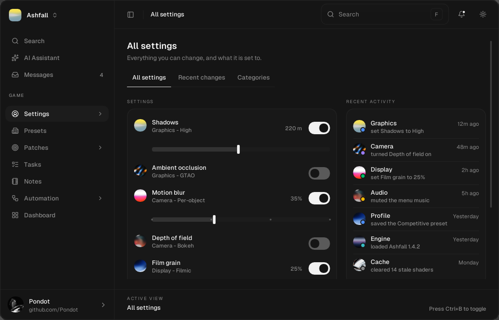
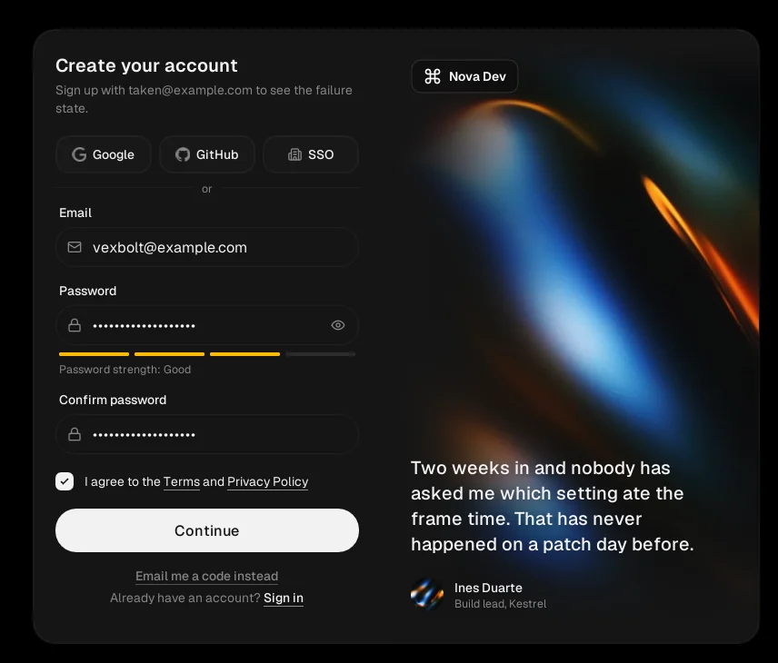
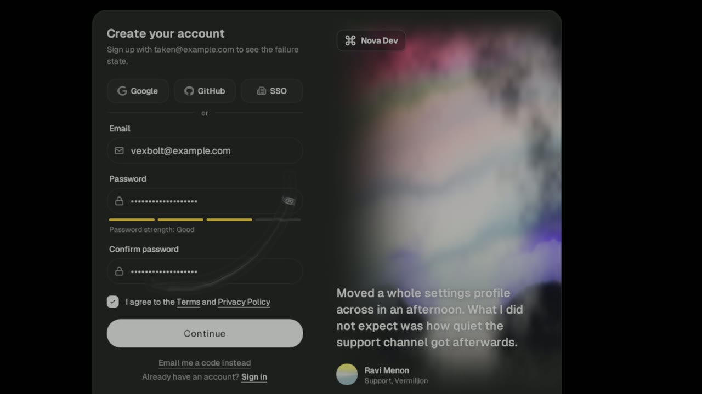

# Solace

An offline Windows interface showcase built with C++20, Dear ImGui, and DirectX 11.
The sign-in screens and provider buttons are local demonstrations; Solace makes no network
requests and does not collect or submit credentials.

[](https://github.com/poncippg-spec/Free-Solace-ImGui-Interface/actions/workflows/build.yml)
[Download the latest release](https://github.com/poncippg-spec/Free-Solace-ImGui-Interface/releases/latest)



## Preview

### YouTube demo

[](https://www.youtube.com/watch?v=R2SeWPtzg3g)

[Watch on YouTube](https://www.youtube.com/watch?v=R2SeWPtzg3g)

### Sign-up screens

<p align="center">
  
  
</p>

The light capture uses the Pondot credit profile; the dark capture demonstrates the
swappable placeholder profile.

### Interface recording

[](https://github.com/poncippg-spec/Free-Solace-ImGui-Interface/releases/download/v0.1.0/solace-demo.mp4)

[Watch the full 35-second recording](https://github.com/poncippg-spec/Free-Solace-ImGui-Interface/releases/download/v0.1.0/solace-demo.mp4)

## Features

- Frameless Win32 window
- Sign-up and sign-in screens
- Animated sidebar and page transitions
- Reusable inputs, menus, tabs, switches, and sliders
- Light and dark themes
- DPI-aware text and layout

## Download

Download `Solace-0.1.0-win64.zip` from the
[latest release](https://github.com/poncippg-spec/Free-Solace-ImGui-Interface/releases/latest), extract
the complete archive, and run `Solace.exe`. The release includes the required assets,
licenses, and a SHA-256 checksum file.

The executable is currently unsigned, so Windows may display an unknown-publisher warning.
Build from source if you prefer not to run the packaged binary.

## Build

Requirements:

- Windows 10 or 11
- Visual Studio 2022
- Desktop development with C++

From PowerShell:

```powershell
git clone https://github.com/poncippg-spec/Free-Solace-ImGui-Interface.git
cd Free-Solace-ImGui-Interface
.\scripts\build.ps1 -Configuration Release
```

The executable is written to:

```text
Release/Solace.exe
```

For a debug build:

```powershell
.\scripts\build.ps1 -Configuration Debug
```

You can also open `Solace.sln` in Visual Studio.

## Controls

- Drag an empty part of the window to move it.
- Press `Ctrl+B` to collapse the sidebar.
- Press `F` to open search.
- Press `Escape` to close the active panel or exit.

## Notes

Keep the `assets` directory with the executable when packaging the interface. Media
redistribution and provider-mark terms are documented in `THIRD_PARTY_NOTICES.md`.

## Project layout

```text
src/          application source
assets/       runtime images
scripts/      build and verification tools
thirdparty/   bundled dependencies
```

## Credits

Created by [Pondot](https://github.com/poncippg-spec).

Third-party licenses and asset notes are listed in [THIRD_PARTY_NOTICES.md](THIRD_PARTY_NOTICES.md).

MIT License. See [LICENSE](LICENSE).
